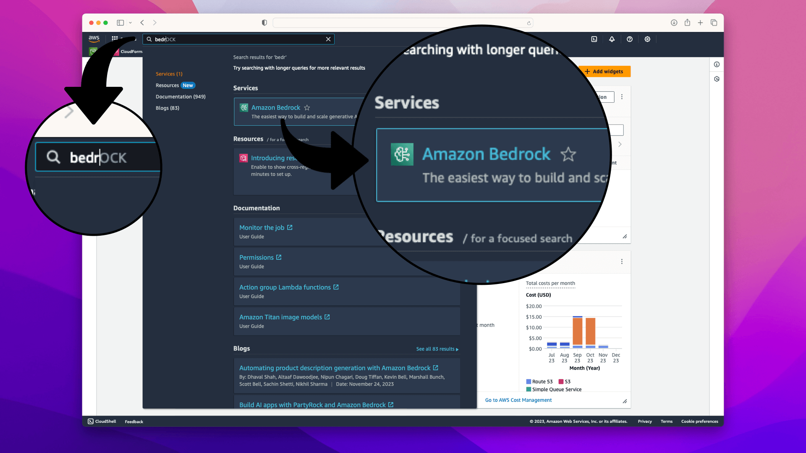
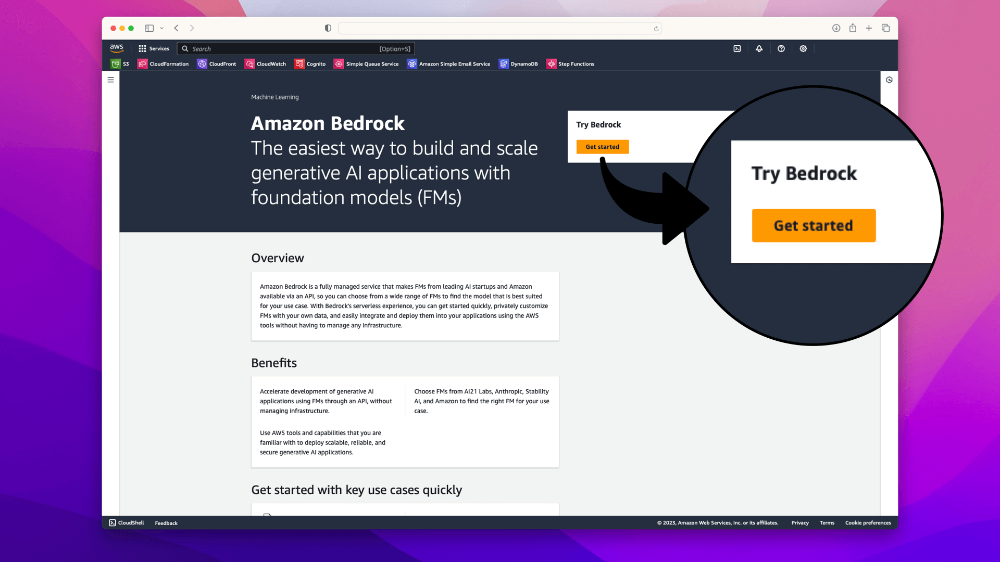
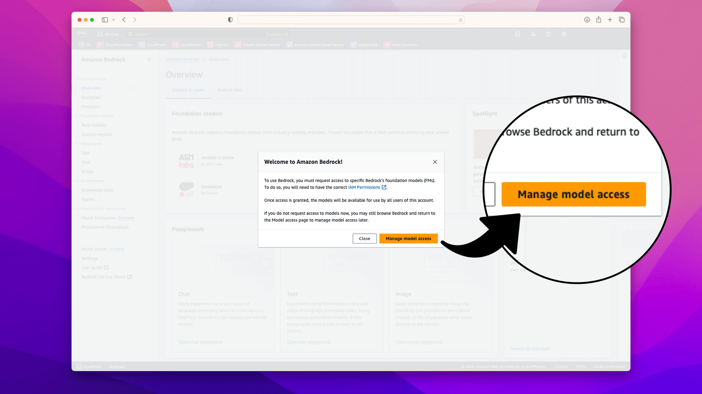
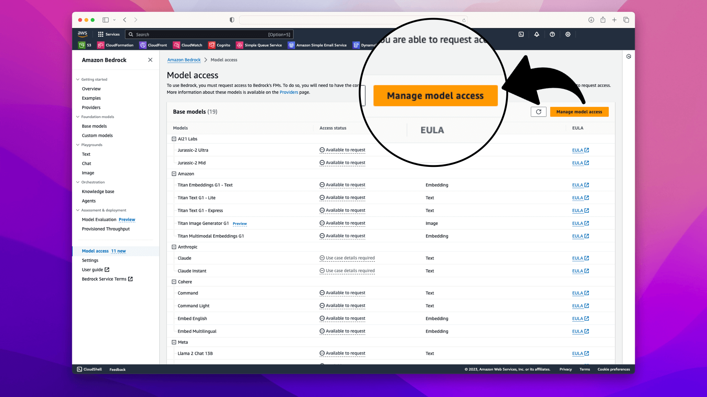
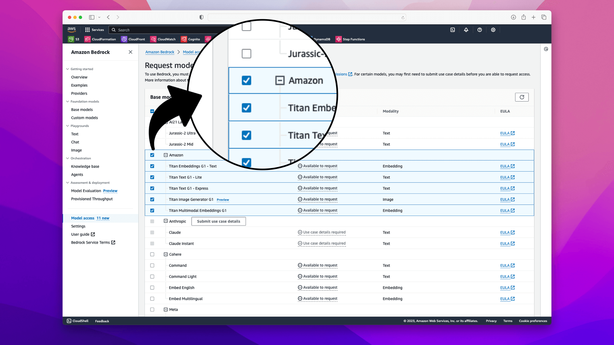
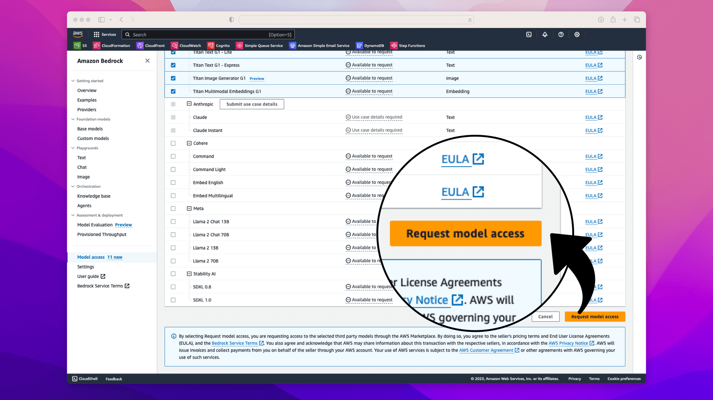
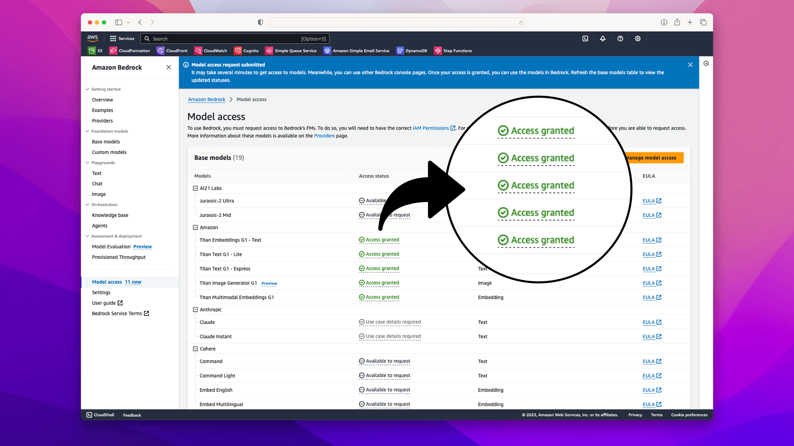
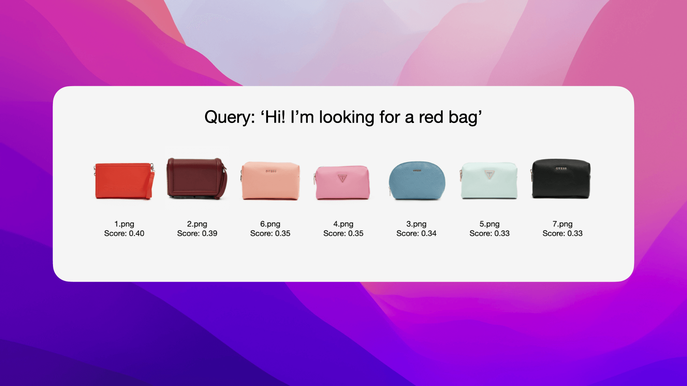

# AI-Driven Product Image Matching with AWS Bedrock

This repository contains a Python project that demonstrates the use of Amazon Bedrock and Amazon Titan models for AI-driven image matching. The project matches customer text queries with relevant product images, showcasing the power of AI in the field of e-commerce and digital customer experience.

## Overview

The project is implemented in a Jupyter Notebook and uses AWS Bedrock's Titan Embed Image model to create and compare embeddings from images and text queries. This allows for efficient and accurate matching of customer queries with product images.

## Amazon Bedrock Pricing Overview

Amazon Bedrock is a fully managed service offering high-performing foundation models (FMs) for building generative AI applications. Pricing for Bedrock involves charges for model inference and customization, with different plans based on usage patterns and requirements.

#### Multi-Modal Models

**Titan Multimodal Embeddings:**
- $0.0008 per 1,000 input tokens
- $0.00006 per input image

**Note:** This is a general overview of pricing. For the most current and detailed pricing information, please refer to the [Amazon Bedrock Pricing Page](https://aws.amazon.com/bedrock/pricing/).

## Prerequisites

- Python 3.x
- Jupyter Notebook
- AWS SDK for Python (Boto3)
- Pandas
- Sklearn (for cosine similarity)
- Base64
- AWS account with access to Bedrock runtime

### Requesting Access to AWS Bedrock Foundation Models

To use the Bedrock foundation models, follow these steps to request access:

#### 1. Log in to AWS
Visit [AWS Management Console](https://aws.amazon.com) and sign in to your AWS account.

#### 2. Navigate to Bedrock
Use the search bar at the top of the AWS Management Console to search for **"Bedrock"**:



#### 3. Initiate Access Request
On the Amazon Bedrock service page, click on **Get Started**:



In the popup, click **Manage Model Access**:



In the resulting page, click **Manage Model Access**:



#### 4. Selecting the Models
In the model access section, choose **Amazon** from the list of available models, this will check all available models:



#### 5. Finalize the Request
Scroll to the bottom of the page and click on **Request Model Access**:



#### 6. Confirmation
After requesting access, you will be redirected back to the Bedrock overview page, where it should now indicate that your access request is pending or granted:




## Setup and Installation

1. Clone this repository to your local machine.
2. Ensure you have Python installed along with the necessary libraries (`pandas`, `boto3`, `sklearn`, `base64`).
3. Set up your AWS credentials to access Bedrock runtime services.

## Usage

1. Initialize the Bedrock runtime with the following code:

    ```python
    import boto3
    from botocore.exceptions import NoCredentialsError

    # Set the AWS profile (replace 'your-profile-name' with your actual profile name)
    aws_profile = 'your-profile-name'

    try:
        boto3.setup_default_session(profile_name=aws_profile)
        bedrock_runtime = boto3.client(
            service_name="bedrock-runtime",
            region_name="us-east-1"
        )
    except NoCredentialsError:
        print("Credentials not found. Please configure your AWS profile.")

2. Encode your product images in Base64 format and store them along with their descriptions.

3. Generate embeddings for each image using the Amazon Titan Embed Image model.

4. Create embeddings for customer queries and compare these with the image embeddings using cosine similarity.

5. The notebook will output a sorted list of images based on their relevance to the customer query.

## Functions

- `encode_image_to_base64(image_path)`: Encodes an image to Base64 format.
- `get_embedding(image_base64=None, text_description=None)`: Generates embeddings using the AWS Bedrock service.

## Example Output

The notebook will display a table of images sorted by their relevance to a given customer query. Each entry includes the image, its name, and a similarity score:



## Need Help?

If you're looking to implement or build a product matching and recommendation system and need some guidance, don't hesitate to reach out. I'm here to help you navigate through the process and make the most of these technologies.

📧 Email me at [norah@braine.ai](mailto:norah@braine.ai) for any inquiries or assistance. Let's make your project a success together!

